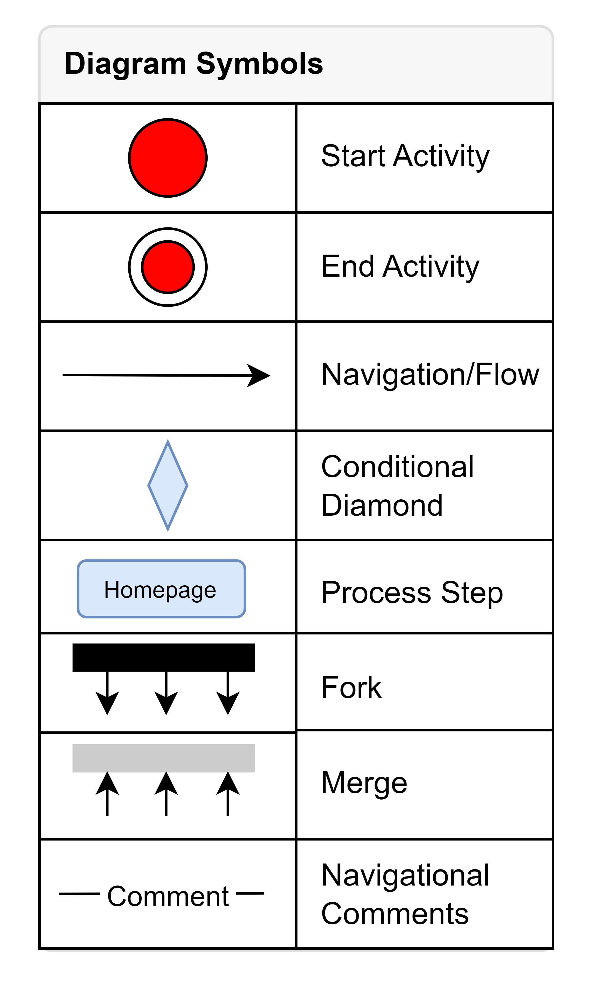

# Activity Flow Diagram

This file provides information about the symbols used in activity flow diagrams along with an example diagram.

## Process Flow Diagram Symbols

This diagram illustrates the symbols commonly used in activity flow diagrams.

## Example Activity Flow Diagram

This example demonstrates the application of the symbols described above in an activity flow diagram.

To continue your diagram design, you can use [draw.io](https://app.diagrams.net/) website. 

1. Download the `.drawio` file from this repository.
2. Open the draw.io website and click on "Open Existing Diagram" to upload the downloaded `.drawio` file.
3. Edit the diagram as needed using the draw.io editor.

Download the .drawio file from this repository [here](<sample.drawio>).
